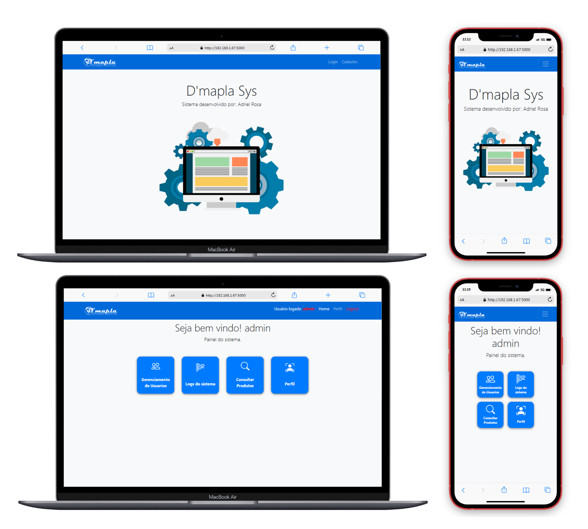
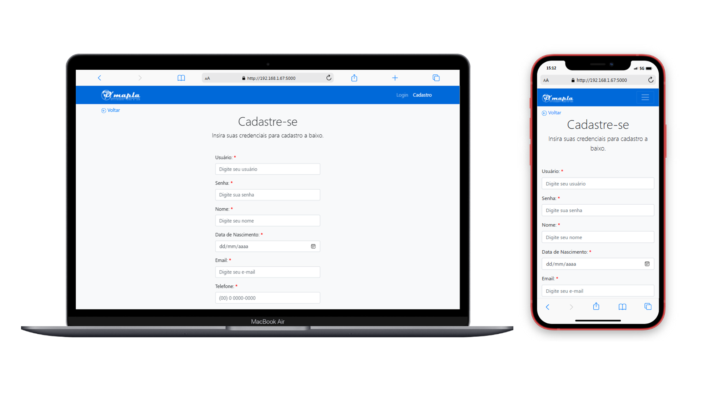
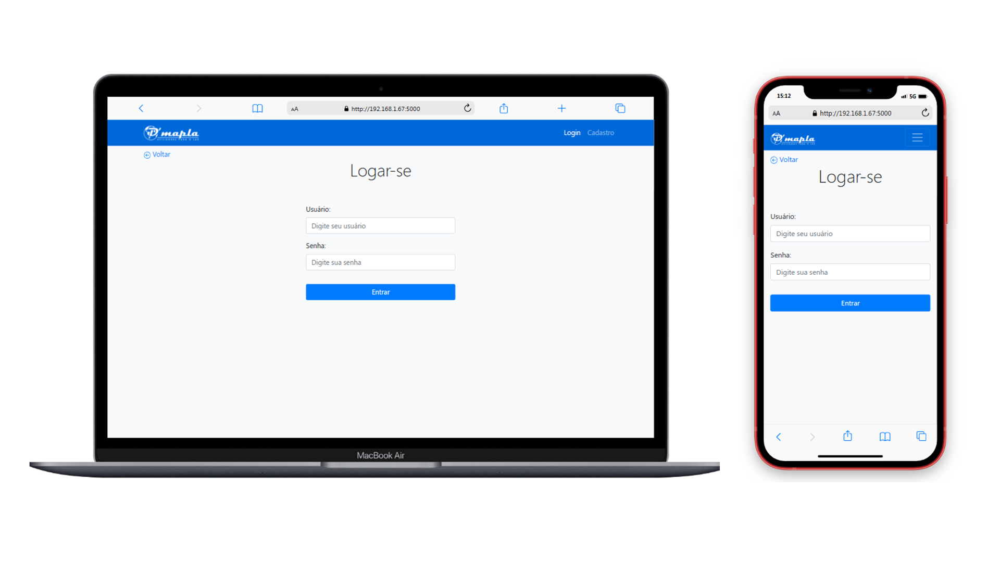
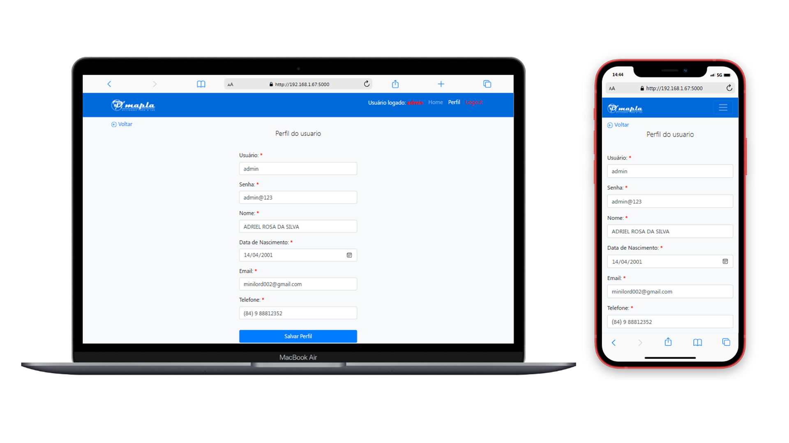
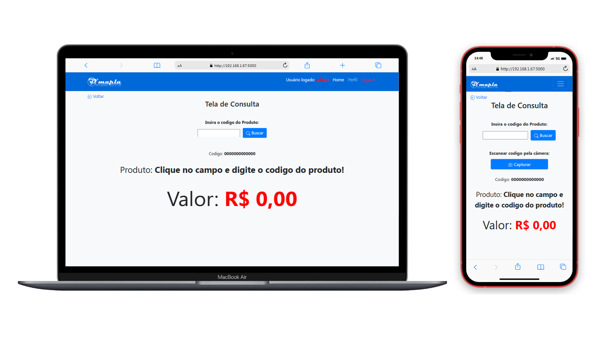
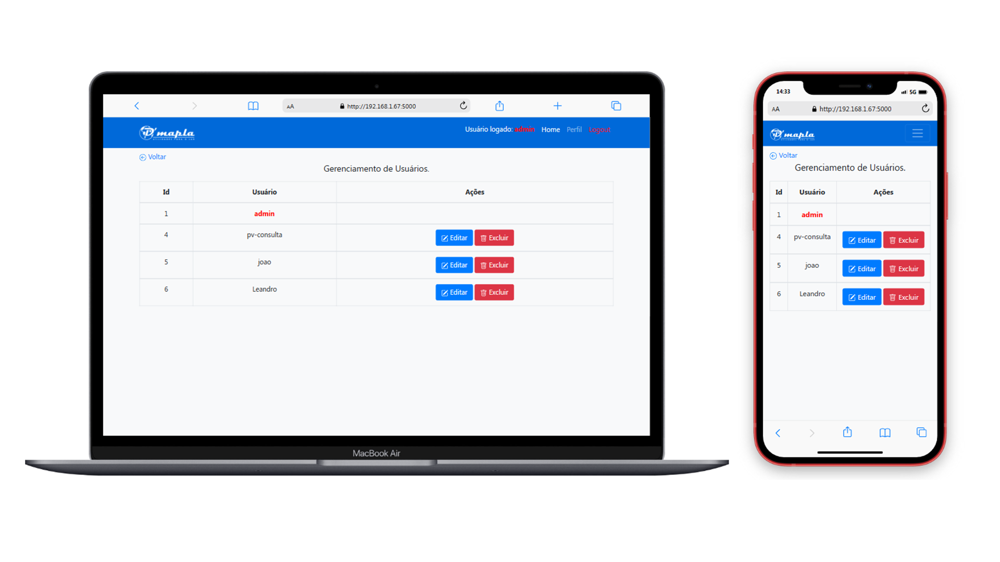
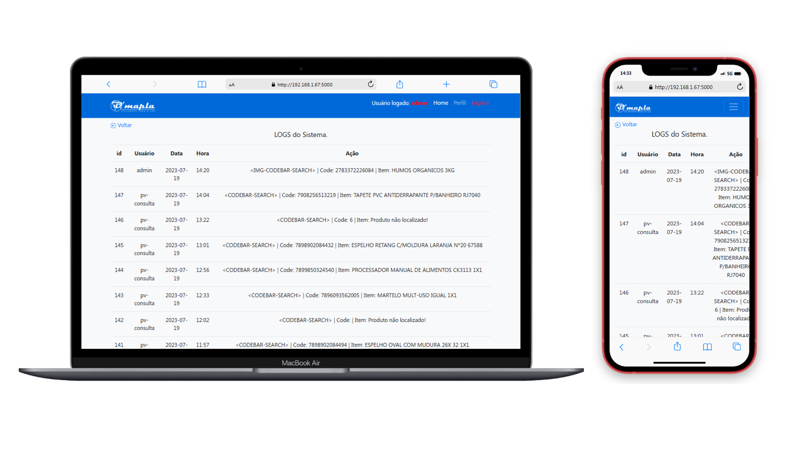

# Dmapla Sys

Sistema Web Feito em Flask destinado a uso interno da empresa D'mapla - Utilidades para o lar

> Adriel Rosa (update 27/07/2023  19:20 PM)

## Funcionalidades: 

### Cadastro:

- Realiza o cadastro de novos usuários fazendo validações de usuarios ja cadastrados com o banco de dados.

##

### Login:

- Realiza o login de usuários no sistema.

##

### Perfil:

- Exibe o perfil do usuario logado permitindo alterações de dados do mesmo.

##

###  Consulta:

##

  ## Consulta PC:

  
  
  - Realiza a consulta de produtos em dispositivos desktop via digitação no input text ou atravez do leitor de codigo de barras.
  
  ###
  
  ## Consulta Mobile:

  
  
  - Realiza consulta de produtos via digitação ou foto do codigo de barras do produto.
  - Foi utilizado o OpenCV para manipulação da imagem e o pyzbar para detecão do codigo de barras na imagem.
  
  ###
  
  ## Gerenciamento de Usuários:

  
  
  - Painel destinado ao gerenciamento de usuários (Apenas o admin do sistema tem acesso ao painel).
  
  ###

  ## Logs do sistema:

  
  
  - Painel destinado a exibição de logs do sistema (Apenas o admin do sistema tem acesso ao painel).
  
  ###

 ##
 
 ## Tecnologias:
 - Flask
 - Flask-SQLAlchemy
 - SQLAlchemy
 - pyodbc
 - waitress
 - opencv-python
 - pathlib
 - pyzbar
 
 ## Contato:
 
 - E-mail: adrielrosa@live.com 
 - LinkedIn: https://www.linkedin.com/in/adriel-rosa-660431144/
